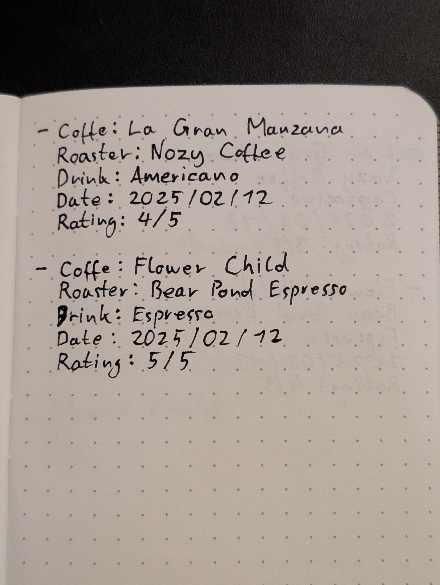

# Kopi

> From Malay _kopi_ (“coffee”) and Hokkien 咖啡 (ko-pi); the latter is also
> derived from the former.\
> -- [Wiktionary](https://en.wiktionary.org/wiki/kopi)

_Kopi_ is a command-line (CLI) coffee journal (or _habit tracker_), designed for
coffee enthusiasts. It lets you track coffee beans, equipment usage, brewing
methods, and individual cups.

The tracked data offers insights into bean and roast preferences, caffeine and
dairy consumption, and equipment usage patterns. This helps users refine their
coffee choices while managing caffeine intake for a more enjoyable and
responsible experience.

_Kopi_ focuses on meticulously tracking every step of the coffee preparation
process. Unlike standard coffee or caffeine tracking apps, it requires more
detailed input to function effectively. If you only want to track the cups of
coffee you drink without monitoring the beans/roasts and the preparation methods
used, _Kopi_ may not be the best fit for you. Think of _Kopi_ as a coffee
journal that lets you rate individual roasts and analyze how different roasts,
brewing methods, and drink types influence your preferences.

_Kopi_ stores everything **locally** and does not send any data to third-party
services unless explicitly mentioned before an operation (e.g. requesting
current exchange rates from the ECB, for price input/conversions of individual
coffee bags). _Kopi_ does not employ analytics libraries/services.

## Status

_Kopi_ is still in its early stages. Some features might not be working as
expected and others might very well be missing. If you **depend** on your coffee
journal, do not use _Kopi_ at this stage, as things might change and, in worst
case, randomly break. If you're feeling adventurous or you're looking to
contribute to the project, please find all the relevant information down below.

## Install

### From Release

Download the [latest release](https://github.com/mrusme/kopi/releases/latest)
and unpack it:

```sh
▲ tar -xzf ./kopi_*.tar.gz
```

The binary `kopi` can be moved wherever you please.

### From Source

Clone this repository

- from [GitHub](https://github.com/mrusme/kopi)
  ```sh
  $ git clone git@github.com:mrusme/kopi.git
  ```

Then cd into the cloned directory and run:

```sh
$ make
```

The binary will be available at `./build/kopi` and can be moved wherever you
please.

## Use

_Kopi_ follows a structured three-step workflow for tracking coffee consumption,
essential for its functionality and insights. The first step is typically done
once — during setup or when equipment changes. The second step is performed
regularly, while the third step, tracking actual consumption, is done for every
cup.

### Steps

#### Step 1: Add equipment

Coffee equipment is the first piece of information that _Kopi_ requires. Most
coffee enthusiasts will usually have at least two pieces of coffee equipment at
their disposal:

- A coffee grinder
- A coffee maker

This equipment needs to be added to _Kopi_ before tracking coffee brewing and
consumption. To do so, the following command is used:

```sh
▲ kopi equipment add
```

The command will guide the user through the adding process. It is also possible
to provide all required fields as flags to the command. For more information on
how to do so, check the output of `kopi equipment add --help`.

**Note:** If you don’t have coffee brewing equipment and typically get your
coffee from a barista, add their brewing method as a _dummy_ entry. For
espresso-based drinks, add an _espresso maker_; for pourovers or AeroPress, add
a _coffee maker_. However, keep in mind that _Kopi_ is **not** designed for
tracking individual cups from various coffee shops—there are better tools for
that. Instead, _Kopi_ is aimed at coffee enthusiasts who want to document their
coffee experiences, ideally using their own brewing methods.

#### Step 2: Open a bag of coffee

Coffee bags are the second key element in tracking brewing and consumption.
Every cup requires a designated bag of coffee. Previously _opened_ bags can be
used until their beans are depleted, at which point a new bag must be _opened_.
Multiple bags can be _open_ at once, but only one can be selected per cup. For
blends, a dedicated bag must be prepared and then _opened_.

To _open_ a new bag of coffee the following command is used:

```sh
▲ kopi bag open
```

The command will guide the user through the opening process. It is also possible
to provide all required fields as flags to the command. For more information on
how to do so, check the output of `kopi bag open --help`.

To list all open bags, the following command can be used:

```sh
▲ kopi bags list
```

_Note:_ `bags` is an alias of the `bag` command that helps with making the
command read more natural. The command `kopi bag list` works and can as well be
used.

#### Step 3: Drink a cup of coffee

To track a cup of coffee, the following command is used:

```sh
▲ kopi cup drink
```

The command will guide the user through the tracking process. It is also
possible to provide all required fields as flags to the command. For more
information on how to do so, check the output of `kopi cup drink --help`.

## Insights

A wide range of insights can be extracted from the data that has been tracked
over time. Here are some examples:

### Ranking

The database calculates an overall ranking for each coffee based on ratings from
individually tracked cups. Use the `kopi coffee ranking` command to view the
ranking:

TODO screenshot

### _"Mobile App"_

_Kopi_ does not have a mobile app to track coffee consumption. Instead, _Kopi_
is using a new approach to tackle this need: **Pen and paper**.

With _Kopi_ it is possible to track cups of coffee using a simple notebook, by
writing down consumed cups in a structured format:



_Kopi_ uses an [Ollama](https://github.com/ollama/ollama) backend to _read_
photos of such notes using `llama3.2-vision` and extract all the information
necessary to automatically import these entries into its database.

For more information on this approach,
[head over to this post](https://xn--gckvb8fzb.com/kopi-track-your-coffee-brewing-consumption/#mobile-app?utm_source=README).

#### Ollama

The Ollama service can either be run locally (on a powerful enough machine) or
remotely. On an AMD Ryzen 9 5950X CPU (no GPU) extracting data from such a photo
usually takes around a minute. On an AMD Ryzen 7 5800U (no GPU), however, it's
almost always 20x slower. Given a
[supported GPU](https://github.com/ollama/ollama/blob/main/docs/gpu.md) these
numbers change drastically.

## Development

_Kopi_ is written in Go and uses
[mattn/go-sqlite3](https://github.com/mattn/go-sqlite3) to store all its data.
Because of this, building _Kopi_ requires `gcc` to be available and
`CGO_ENABLED=1` to be set.

Whether you're a developer looking to contribute, or you're interested in
understanding the inner workings of the project, this section will guide you
through the development setup, the architecture of the code, and how you can get
involved. If you plan to contribute or make modifications, feel free to follow
along and dive into the Go codebase to help improve this tool!

### CGO

Before building _Kopi_, make sure that CGO is enabled inside your Go
environment:

```sh
go env | grep CGO_ENABLED
```

If CGO is not enabled (`0`) try manually enabling it:

```sh
go env -w CGO_ENABLED=1
```

If this command fails with something along the lines of
`cgo: C compiler "gcc" not found: exec: "gcc": executable file not found` your
Go installation cannot seem to find the `gcc` compiler. Make sure you have `gcc`
installed and available in your `$PATH`.

### Build

_Kopi_ can be build using the standard `go build` command.

### Implementation

The following section gives an overview of how the application is built and how
its features are implemented, providing an in-depth look at the decisions and
structure behind the code.

#### Database & database access

_Kopi_ uses Sqlite3 to store all its data locally. The database structure and
seed data is available within the [migrations](migrations/) folder.

The Go code it built around a minimal _Database Abstraction Layer_ (_DAL_), as
well as individual _entities_ (`Bag`, `Coffee`, `Cup`, etc.) which have _models_
that are built upon _generic Data Access Objects_ (_DAOs_). This data
architecture uses _generics_ to reduce the required boilerplate and keep the
implementation as lightweight and _DRY_ as possible. The concept was documented
by James Kirk in [this repository](https://github.com/Jimeux/go-generic-dao) and
contains a write-up with the implementation details.

#### Coffee and caffeine

_Kopi_ makes some assumptions about coffee and its caffeine contents. It uses a
formula to approximate the caffeine content in a coffee drink based on the
amount of ground coffee, brewing method and roast level:

```math
C = G \times E_m \times R \times (1 - L_m)
```

where:

- $\( C \)$ = estimated caffeine content in milligrams (mg)
- $\( G \)$ = mass of ground coffee used (grams)
- $\( E_m \)$ = base extraction yield (mg of caffeine per gram of coffee,
  dependent on brewing method)
- $\( R \)$ = roast level adjustment factor
- $\( L_m \)$ = loss factor due to filtration, retention, or degradation
  (fractional value, dependent on brewing method)

The following values for $\( E_m \)$ (Base Extraction Yield by Brewing Method)
are assumed:

| Brewing Method                               | Base Extraction Yield $\(E_m\)$ (mg/g) |
| -------------------------------------------- | -------------------------------------- |
| **Espresso**                                 | 20 mg/g                                |
| **Drip Coffee (Filter, Pour-over, Machine)** | 15 mg/g                                |
| **French Press (Immersion Brewing)**         | 12 mg/g                                |
| **AeroPress**                                | 14 mg/g                                |
| **Cold Brew**                                | 10 mg/g                                |
| **Turkish Coffee (Cezve)**                   | 22 mg/g                                |
| **Moka Pot**                                 | 18 mg/g                                |

The following values for $\( L_m \)$ (Loss Factor by Brewing Method) are
assumed:

| Brewing Method                               | Approximate Loss Factor $\(L_m\)$ |
| -------------------------------------------- | --------------------------------- |
| **Espresso**                                 | 0.05                              |
| **Drip Coffee (Filter, Pour-over, Machine)** | 0.10                              |
| **French Press (Immersion Brewing)**         | 0.05                              |
| **AeroPress**                                | 0.10                              |
| **Cold Brew**                                | 0.15                              |
| **Turkish Coffee (Cezve)**                   | 0.05                              |
| **Moka Pot**                                 | 0.08                              |

The following values for $\( R \)$ (Roast Level Adjustment Factor) are assumed:

| Roast Level      | Adjustment Factor $\(R\)$ |
| ---------------- | ------------------------- |
| **Light Roast**  | 0.95                      |
| **Medium Roast** | 1.00                      |
| **Dark Roast**   | 1.10                      |

Further, the following assumptions are made:

- Light roasts have a slightly lower extraction efficiency $\(R = 0.95\)$.
- Medium roasts serve as the baseline $\(R = 1.00\)$.
- Dark roasts extract more caffeine per gram due to their porous structure $\(R
  = 1.10\)$.

The _Approximate Extraction Yields_ $\(E_m\)$, as well as the _Approximate Loss
Factors_ $\(L_m\)$ for different brewing methods are stored within each
individual [method's database entry](migrations/006_methods.up.sql).

#### Example

For a _drip coffee_ using 20g of lightly roasted $\(R\)$ ground coffee $\(G\)$,
an extraction yield of 15mg $\(E_m\)$ and a loss factor $\(L_m\)$ of 0.10, the
calculation looks as following:

```math
\begin{align}
C = 20 \times 15 \times 0.95 \times (1 - 0.10) \\

C = 20 \times 15 \times 0.95 \times 0.90 \\

C = 256 \text{ mg}
\end{align}
```

A cup would hence contain roughly 256 mg of caffeine.

#### Currency

_Kopi_ allows users to enter prices for the coffee that they add to the
database. _Kopi_ stores all prices in USD, rather than in the currency of the
user. This allows for easier price comparisons at a later stage. To support
different currencies and convert them into USD the tool uses a conversion
document published by the European Central Bank:

```
https://www.ecb.europa.eu/stats/eurofxref/eurofxref-daily.xml
```

If the user adds a price to a coffee bag, they will be prompted with whether
they would like to query the service to retrieve up to date currency conversion
information.

There is an ongoing effort of dedollarisation by also storing the price in
 1/100000000 of a Bitcoin (Satoshis, or _Sats_) for use as a base currency at a
later stage.
